# CS_Dec
## 一、工具介绍

用于解密 Cobalt Strike 的通讯流量。代码源自 [DidierStevensSuite](https://github.com/DidierStevens/DidierStevensSuite)  和 [WBGlIl/CS_Decrypt](https://github.com/WBGlIl/CS_Decrypt)，进行了一些简单修改。

## 二、使用教程

### 2.1 安装与使用

- 脚本基于 Python3，请确保已在 Windows 的环境变量中正确配置 Python3：

  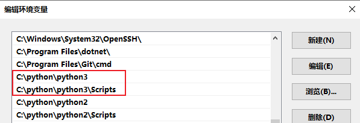

- 先安装依赖，然后直接执行 `CS_Dec.bat` 即可：

  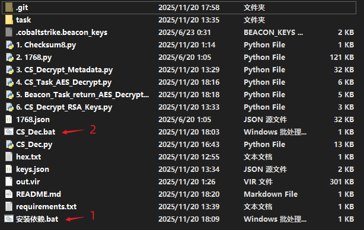

### 2.2 运行截图

1. Checksum8 规则检查：

   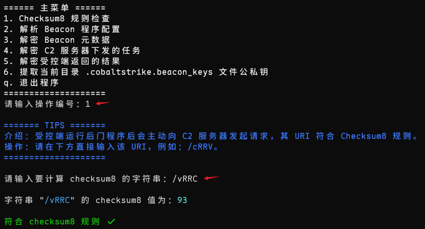

2. 解析 Beacon 程序配置：

   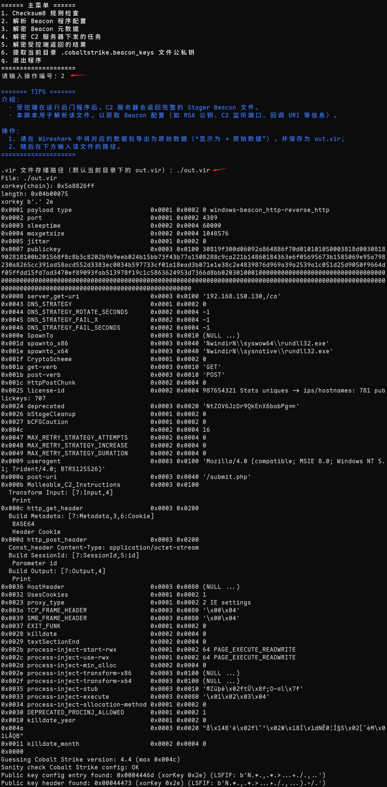

3. 解密 Beacon 元数据：

   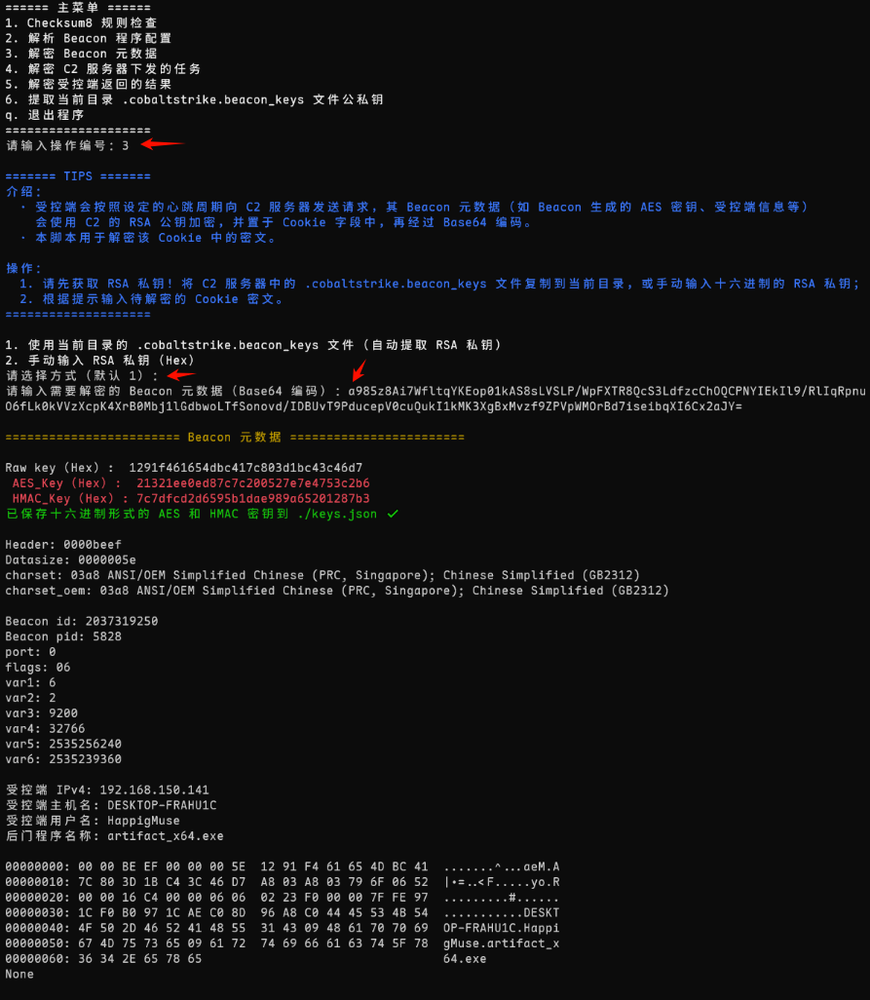

4. 解密 C2 服务器下发的任务：

   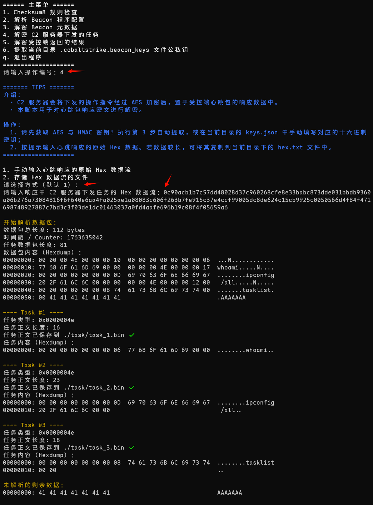

   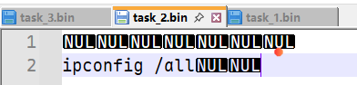

5. 解密受控端返回的结果：

   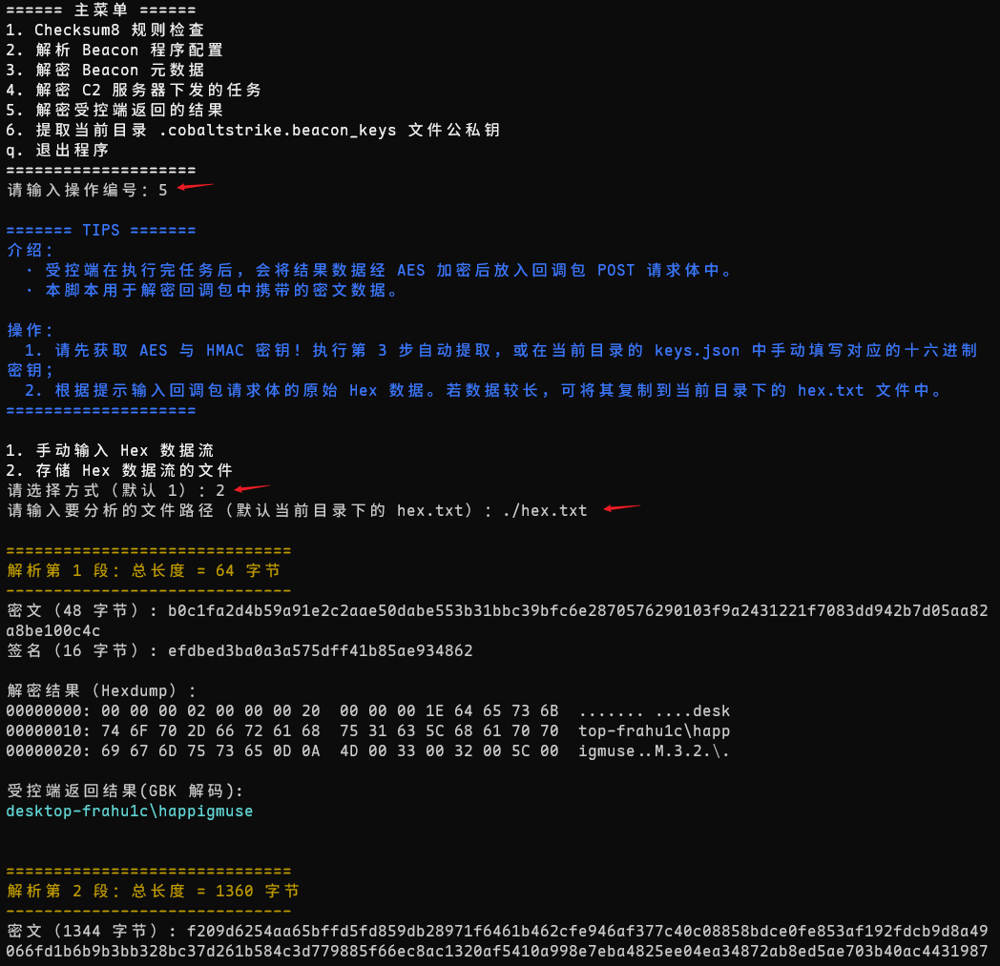

   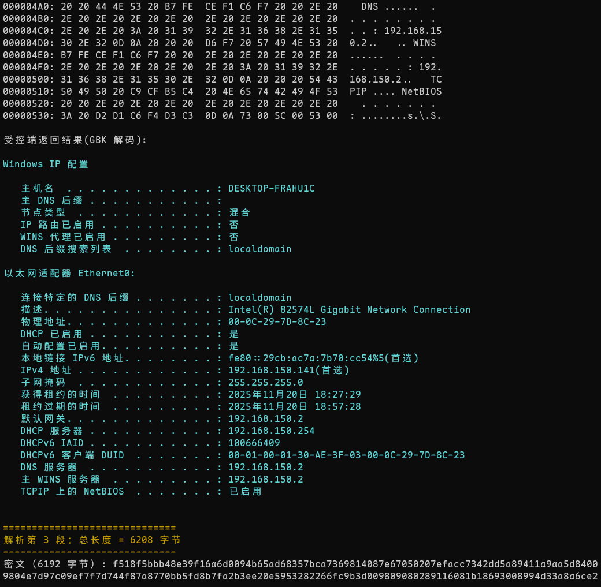

   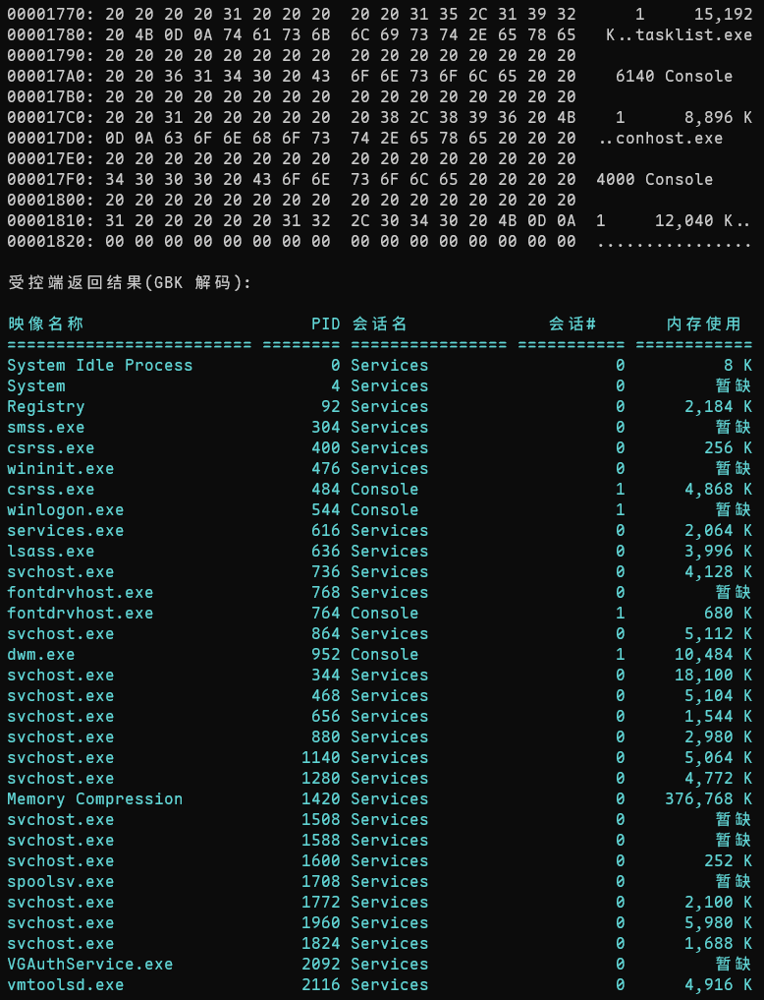

6. 提取 `.cobaltstrike.beacon_keys` 文件公私钥：

   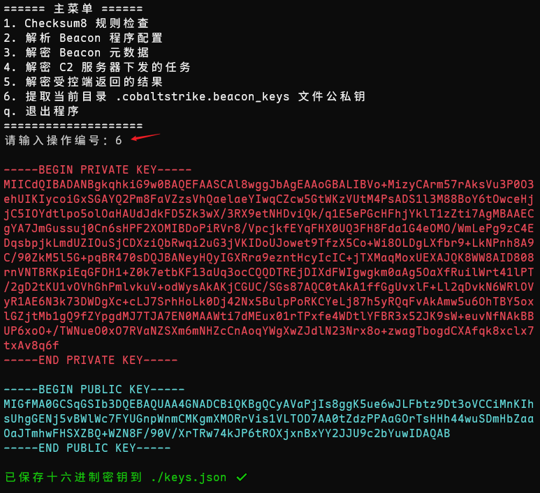

